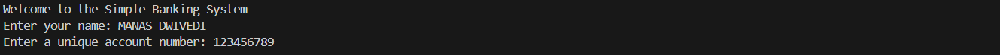

# **Simple-Banking-System** 🏦  

A **Java-based console application** simulating a simple banking system. This project provides core banking functionalities such as account creation, deposit, withdrawal, and transaction history tracking. It also incorporates robust input validation and demonstrates fundamental **object-oriented programming (OOP)** concepts for efficient account management.  

---

## **Features** ✨  

- **Account Creation**:  
  Create new bank accounts with details such as account holder name, account number, and initial deposit.  

- **Deposit Funds**:  
  Add money to an existing account while ensuring proper validation.  

- **Withdraw Funds**:  
  Securely withdraw money from an account, checking for sufficient balance.  

- **Transaction History**:  
  View a detailed list of all transactions for a specific account.  

- **Account Management**:  
  Display account details and balance for any user.  

---

## **Technologies Used** 🛠️  

- **Java**: Programming language used to develop the application.  
- **Collections Framework**: To store and manage account data effectively.  
- **Object-Oriented Programming**: Concepts like classes, objects, encapsulation, and inheritance.  
- **Console-based UI**: A straightforward text-based interface for user interactions.  

---

## **How It Works** 💻  

- **Account Creation**:  
  Input user details to create a new account and store them in a collection.  
  

- **Deposit/Withdraw Funds**:  
  Users can securely deposit or withdraw funds, with checks for valid amounts and balances.  
    
  

- **View Transaction History**:  
  Access a complete log of all deposits and withdrawals for any account.  
  
  

---

## **Author** 🧑‍💻  

- **Manas Dwivedi**: Developer of this project.  

